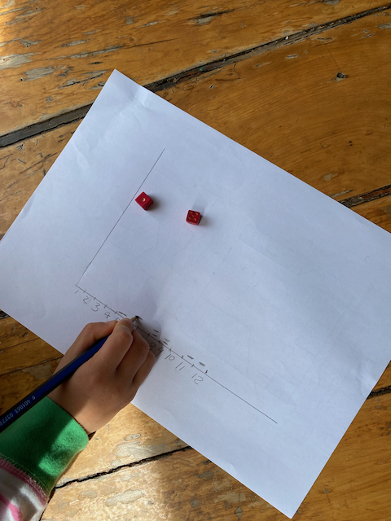
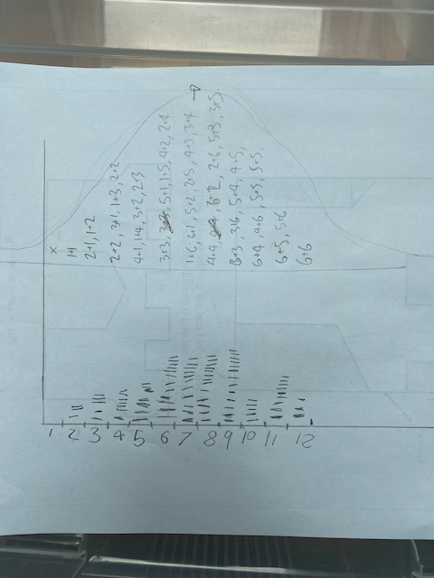

# the-mountain

When maths meets the real world.

## Setup

This project uses [Rye](https://rye-up.com/) for Python dependency management.

### Install Rye

First, install Rye by following the [installation instructions](https://rye-up.com/guide/installation/).

### Install the packages

```bash
rye sync
```

## Probability

[Probs.ipynb](src/the_mountain/probs.ipynb)

This notebook explores the probability of rolling two dice, adding the numbers together then plotting the results. 

First though - start with paper! All you need is a pen and paper and 2 dice. Draw something up that looks like this:



Now gets to rolling! 

We had a fun conversation about why certaing numbers kept coming up so we wrote the combinations down. Some numbers have more combinations than others! :) 



Then you can run the notebook to simulate rolling the dice 100,000 times. 

### Extensions

A fun exercise is to see what happens if you use 3 dice (or more). 